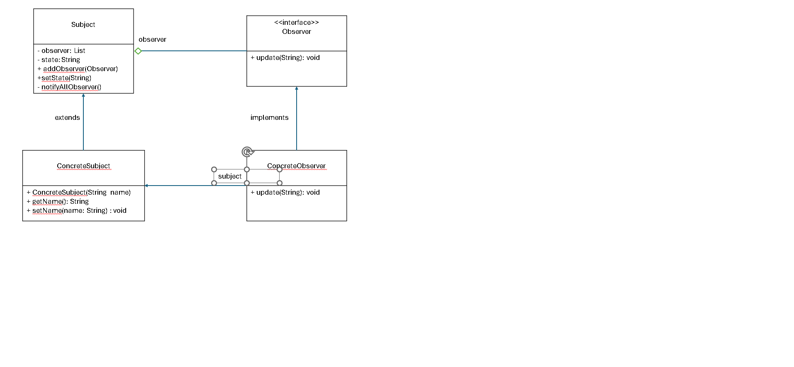
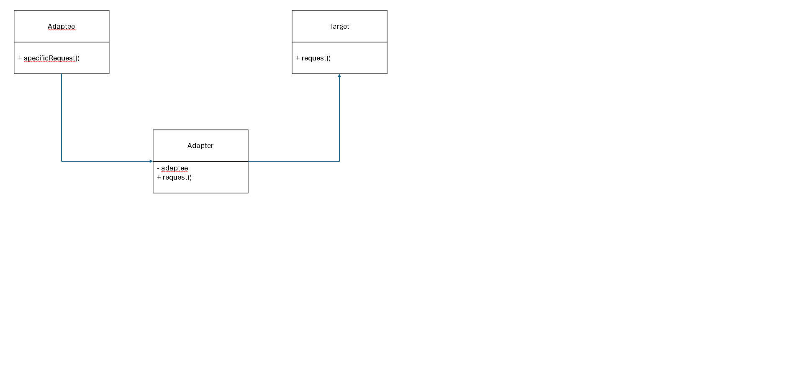

1. Design Pattern:
- Dessign pattern là các giải pháp tổng thể đã được tối ưu hóa, được tái sử dụng cho các vấn đề phổ biến trong thiết kế phần mềm.  
- Lợi ích của Design pattern:  
+Giúp sản phẩm linh hoạt dễ bảo trì hơn.  
+Design pattern cung cấp những giải pháp đã được tối ưu hóa, đã được kiểm chứng để giải quyết các vấn đề trong software engineering.  
+Những lúc khi bạn gặp bất kỳ khó khăn đối với những vấn đề đã được giải quyết rồi, design patterns là hướng đi giúp giải quyết vấn đề.  
+Giúp hiểu code của người khác một cách nhanh chóng

2. Singleton (Nhóm khởi tạo):  
a. Singleton là gì?  
- Singleton là một mẫu thiết kế (design pattern) thuộc nhóm khởi tạo (creational pattern) đảm bảo rằng một lớp chỉ có một instance (thực thể) duy nhất và cung cấp một điểm truy cập toàn cục (global access point) đến instance đó.  
b. Cấu trúc:
- Private Static Instance: Một biến tĩnh (static) để lưu trữ thể hiện duy nhất của lớp.  
- Private Constructor: Constructor của lớp được đặt là private để ngăn chặn việc tạo thể hiện từ bên ngoài lớp.  
- Public Static Method: Một phương thức tĩnh công khai để trả về thể hiện duy nhất của lớp. Phương thức này sẽ tạo thể hiện nếu nó chưa tồn tại và trả về thể hiện đã tồn tại nếu nó đã được tạo trước đó.  
c. Dùng để làm gì?  
- Singleton được sử dụng khi cần duy trì một instance duy nhất của một lớp trong suốt quá trình chạy của ứng dụng.  
d. Tại sao nên sử dụng Singleton?  
- Đảm bảo chỉ có một instance của lớp được tạo, giúp kiểm soát tài nguyên tốt hơn.  
- Tiết kiệm tài nguyên: Tránh tạo nhiều instance không cần thiết, giúp tiết kiệm bộ nhớ và tài nguyên hệ thống.  
- Điểm truy cập toàn cục: Cung cấp một điểm truy cập duy nhất đến instance, dễ dàng quản lý và sử dụng từ bất kỳ đâu trong ứng dụng.
- Dễ dàng trong việc thay đổi hoặc mở rộng: Có thể dễ dàng mở rộng Singleton để hỗ trợ các tính năng bổ sung mà không làm ảnh hưởng đến mã hiện tại.  
e. Nhược điểm:  
- Khó kiểm tra: Singleton làm cho việc viết các bài kiểm tra đơn vị (unit tests) khó khăn hơn vì nó có trạng thái toàn cục và không dễ dàng khởi tạo lại.  
- Phạm vi toàn cục: Singleton có phạm vi toàn cục và nếu không được quản lý tốt, có thể dẫn đến các vấn đề về tình trạng đua (race condition) trong môi trường đa luồng.  
- Thiếu tính linh hoạt: Singleton có thể hạn chế khả năng mở rộng và tái sử dụng mã vì nó buộc phải có một instance duy nhất.  

```public class Singleton {
private static final Singleton obj = new Singleton();

    private Singleton(){
    }

    public static Singleton getObj(){
        return obj;
    }

    public void display(){
        System.out.println("This is a Singleton example");
    }
}
```


3. Observer (Nhóm hành vi):  
a. Observer là gì?
- Observer là một mẫu thiết kế hành vi định nghĩa một cơ chế đăng ký và thông báo cho phép một đối tượng (subject) tự động thông báo cho một hoặc nhiều đối tượng khác (observers) về bất kỳ thay đổi trạng thái nào, thường bằng cách gọi một phương thức của các đối tượng này.  
b. Cấu trúc:
- Subject : chứa danh sách các observer,  cung cấp phương thức để có thể thêm và loại bỏ observer.
- Observer : định nghĩa một phương thức update() cho các đối tượng sẽ được subject thông báo đến khi có sự thay đổi trạng thái.
- ConcreteSubject : cài đặt các phương thức của Subject, lưu trữ trạng thái danh sách các ConcreateObserver, gửi thông báo đến các observer của nó khi có sự thay đổi trạng thái.  
- ConcreteObserver : cài đặt các phương thức của Observer, lưu trữ trạng thái của subject, thực thi việc cập nhật để giữ cho trạng thái đồng nhất với subject gửi thông báo đến.  
c. Dùng để làm gì?
- Mẫu thiết kế Observer được sử dụng để giải quyết vấn đề khi có một đối tượng (subject) cần thông báo cho nhiều đối tượng khác (observers) về sự thay đổi của nó mà không cần phải biết chính xác các đối tượng này là gì.  
d. Nhược điểm:
- Khi số lượng observers tăng lên, việc thông báo đến tất cả observers có thể làm giảm hiệu suất, đặc biệt nếu có nhiều thao tác phức tạp.  
- Vì có nhiều đối tượng tương tác qua lại mà không rõ ràng, việc theo dõi và gỡ lỗi các vấn đề có thể trở nên khó khăn.  
- Nếu không quản lý đúng cách, có thể dẫn đến rò rỉ bộ nhớ do các observer không được xóa khỏi danh sách observers của subject khi không còn sử dụng.  

```java
import java.util.ArrayList;
import java.util.List;

// Observer
public interface Observer {
    void update(String message);
}

// Subject
public class Subject {
    private List<Observer> observers = new ArrayList<>();
    private String state;

    public void addObserver(Observer observer) {
        observers.add(observer);
    }

    public void removeObserver(Observer observer) {
        observers.remove(observer);
    }
    
    public void setState(String state) {
        this.state = state;
        notifyAllObservers();
    }

    private void notifyAllObservers() {
        for (Observer observer : observers) {
            observer.update(state);
        }
    }
}

// Concrete Subject
public class ConcreteSubject extends Subject {
    private String name;

    public ConcreteSubject(String name) {
        this.name = name;
    }

    public String getName() {
        return name;
    }

    public void setName(String name) {
        this.name = name;
    }
}

// Concrete Observer
public class ConcreteObserver implements Observer {
    @Override
    public void update(String message) {
        System.out.println("Received message: " + message);
    }
}
```


4. Adapter (Nhóm cấu trúc):  
a. Adapter là gì?  
- Adapter là mẫu thiết kế cấu trúc cho phép các giao diện không tương thích có thể làm việc cùng nhau. Nó hoạt động như một cầu nối giữa hai giao diện không tương thích, giúp cho các lớp không liên quan đến nhau có thể hợp tác mà không cần thay đổi mã nguồn của chúng.  
b. Cấu trúc:
- Target Interface: Giao diện mà Client mong đợi. Đây là giao diện mà adapter sẽ chuyển đổi để phù hợp với adaptee.  
- Client: Đối tượng sử dụng Target Interface.  
- Adaptee: Lớp hiện có mà bạn muốn tích hợp với hệ thống, nhưng có một giao diện không tương thích.  
- Adapter: Lớp giúp chuyển đổi giao diện của Adaptee sang giao diện mà Client mong đợi (Target Interface).  
c. Dùng để làm gì?
- Adapter Pattern được sử dụng khi muốn sử dụng lại một số lớp hiện có, nhưng giao diện của chúng không khớp với giao diện mà ta cần.  
d. Nhược điểm:
- Tăng thêm lớp trừu tượng, có thể làm cho hệ thống phức tạp hơn.
```java
// Target
public interface Target {
    void request();
}
// Adaptee
public class Adaptee {
    public void specificRequest() {
        System.out.println("Specific request.");
    }
}
// Adapter
public class Adapter implements Target {
    private Adaptee adaptee;

    public Adapter(Adaptee adaptee) {
        this.adaptee = adaptee;
    }

    @Override
    public void request() {
        adaptee.specificRequest();
    }
}
// Main
public class Main {
    public static void main(String[] args) {
        Adaptee adaptee = new Adaptee();
        Target adapter = new Adapter(adaptee);

        adapter.request();  
    }
}
```

