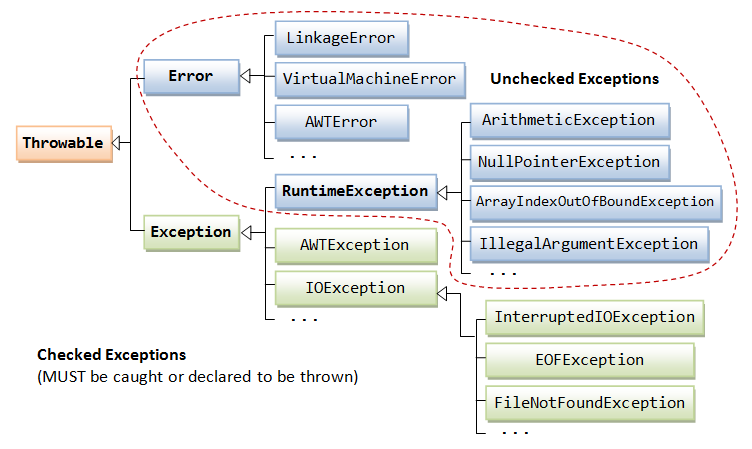

1. Khái niệm:
- Exception (ngoại lệ) là một sự kiện xảy ra trong quá trình thực thi một chương trình Java, nó làm phá vỡ luồng xử lý bình thường của một chương trình.  
2. Hệ thống:

- Sơ đồ phân cấp của Exception trong Java là:  
  + Class ở mức cao nhất là Throwable.
  + Hai class con trực tiếp là Error và Exception.  
- Error là những vấn đề nghiêm trọng liên quan đến môi trường thực thi của ứng dụng hoặc hệ thống mà lập trình viên không thể kiểm soát. Nó thường làm chết chương trình. Lớp Error định nghĩa các ngoại lệ mà không thể bắt (catch) từ chương trình.
- Đối với Exception được chia làm 2 loại checked exceptions và unchecked exceptions.
3. Checked Exceptions:
- Là loại exception xảy ra trong lúc compile time, bắt buộc ta phải handle nó.  
- Ví dụ là FileNotFoundException.  
  + Điều này xảy ra khi một ứng dụng cố gắng mở hoặc truy cập một tệp tin mà không tồn tại hoặc không thể truy cập vì một lý do nào đó.
  + Cách xử lý là kiểm tra sự tồn tại của tệp, kiểm tra đường dẫn tệp và quyền truy cập vào tệp.
4. Unchecked Exceptions:
- Là loại exception xảy ra tại thời điểm thực thi chương trình, loại exception này được bỏ qua trong quá trình compile, không bắt buộc ta phải handle nó.  
- Ví dụ là NullPointerExcption
  + Điều này xảy ra khi một biến có giá trị null, thực hiện bất kỳ hoạt động nào bởi biến đó sẽ xảy ra ngoại lệ NullPointerException.  
  + 2 cách tốt nhất để xử lý vấn đề này là sửa lỗi nơi tạo ra đối tương Null và trước khi thao tác phải kiểm tra xem đối tượng có Null hay không.  
- Ngoài ra có một cách để xử lý cả Checked và Unchecked Exception là đưa ra cú pháp khối lệnh try (try - catch và try - catch - finally) để xử lý ngoại lệ.
