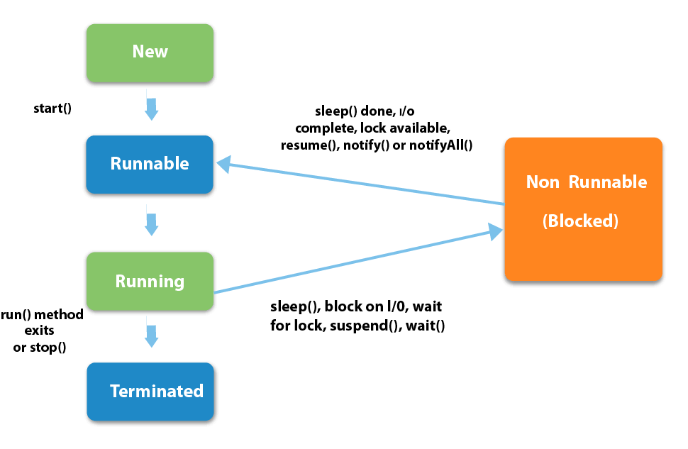

# Đa luồng trong Java

### Luồng (Thread)
- Trong lập trình, một luồng là đơn vị cơ bản của quá trình thực thi trong một ứng dụng. Mỗi luồng đại diện cho một dải công việc hoặc một đơn vị xử lý riêng biệt mà hệ điều hành hoặc môi trường chạy ứng dụng có thể thực hiện đồng thời.
### Tiến trình (Process)
- Tiến trình là một đơn vị hoạt động độc lập trong hệ điều hành, chứa tất cả dữ liệu và tài nguyên cần thiết để thực thi một chương trình.
- Một chương trình chạy có thể có nhiều thread, Cho phép chương trình đó chạy trên nhiều luồng một cách "đồng thời".
### Vòng đời của Thread
- Mới tạo (New): Khi một Thread mới được khởi tạo nhưng chưa bắt đầu chạy, nó ở trạng thái “New”. Ở trạng thái này, Thread chưa được liên kết với hệ thống phân bổ tài nguyên, và chưa được đưa vào hàng đợi CPU.
- Chạy (Runnable): Khi một Thread đã được khởi động bằng phương thức start(), nó chuyển sang trạng thái “Runnable”. Ở trạng thái này, Thread đang chờ đợi CPU để thực thi mã của nó.  
- Chờ (Waiting): Trong quá trình hoạt động, một Thread có thể phải chờ một điều kiện nào đó để tiếp tục. Khi một Thread ở trạng thái “Waiting”, nó không thực thi mã của nó và giải phóng tài nguyên CPU để các Thread khác có thể sử dụng.  
- Ngủ (Sleeping): Trạng thái “Sleeping” là khi một Thread đang ngủ trong một khoảng thời gian xác định, sau đó tự động chuyển sang trạng thái Runnable. Khi một Thread ở trạng thái Sleeping, nó không thực thi mã của nó và giải phóng tài nguyên CPU.  
- Kết thúc (Terminated): Khi một luồng hoàn thành công việc của nó hoặc bị dừng bởi một lý do nào đó, nó chuyển sang trạng thái “Terminated”. Khi một Thread ở trạng thái này, nó không thể tái sử dụng, và bạn cần tạo một Thread mới nếu muốn thực hiện lại công việc đó.  

### Tạo Thread
Có 2 cách chính để tạo một thread:
- Tạo Thread bằng cách kế thừa lớp java.lang.Thread: Để tạo một Thread bằng cách kế thừa lớp Thread, bạn cần tạo một lớp con của lớp Thread và ghi đè phương thức run().  
```java
public class Main {
    public static void main(String[] args) {

    MyThread myThread = new MyThread();

    myThread.start(); // Khởi chạy luồng
    }
}
```
- Tạo Thread bằng cách triển khai giao diện java.lang.Runnable: Cách thứ hai để tạo Thread là triển khai giao diện Runnable. Để làm điều này, bạn cần tạo một lớp triển khai giao diện Runnable và định nghĩa phương thức run().
```java
class MyRunnable implements Runnable {
    @Override
    public void run() {
    // Công việc của luồng
    }
}
```

# ThreadPool
Thread được sinh ra để thực hiện một nhiệm vụ cụ thể, nhiều Thread cùng xử lý công việc giúp chúng ta giải quyết được bài toán thời gian và hiệu năng khi xử lý một tác vụ nào đó.  
*Bài toán đặt ra ở đây là có phải cứ sinh ra nhiều Thread thì tác vụ của chúng ta sẽ nhanh hơn mượt mà hơn?*  
Câu trả lời là không phải cứ tạo nhiều Thread cùng hoạt động thì sẽ đem lại hiệu năng cao vì mỗi khi có một Thread mới được tạo ra và được cấp phát bộ nhớ bằng từ hóa new thì sẽ có vấn đề bộ nhớ và hiệu suất -> có thể dẫn tới crash chương trình.  
=> Để giải quyết bài toán đó ThreadPool ra đời để giới hạn số lượng Thread được chạy bên trong ứng dụng chúng ta cùng một thời điểm.  

### ThreadPoolExecutor

- Các đối tượng ThreadPool Executor chấp nhận Runnable và đặt nó vào một Runnable Queue, Bản thân ThreadPool nó là một chuỗi các luồng đang chờ để kéo Runnables ra khỏi hàng đợi và thực hiện chúng theo các phương thức run() riêng của chúng. Khi có một Runnable mới trong hàng đợi, một trong các luồng sẽ kéo nó ra và gọi phương thức run() của Runnable.    
- ThreadPoolExecutor giúp quản lý và tối ưu hóa việc thực thi các tác vụ đồng thời bằng cách tái sử dụng một nhóm luồng, giảm chi phí tạo và hủy luồng, và kiểm soát số lượng luồng hoạt động để tránh quá tải tài nguyên hệ thống.
