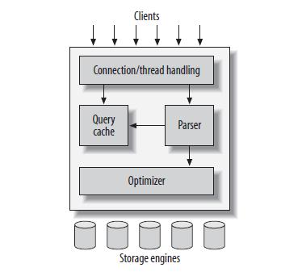

## Kiến trúc của MySQL bao gồm các lớp chính sau:


Từ đây ta có thể thấy lớp SQL bao gồm các phần chính:
- Clients
- SQL
  + Connection/thread handling
  + Query cache
  + Parser
  + Optimizer
- Storage engines

## Clients

- Lớp trên cùng này chứa các dịch vụ liên quan đến giao tiếp - kết nối của MySQL. Client gửi yêu cầu đến máy chủ thông qua Lớp Client. Nếu các truy vấn hợp lệ, kết quả sẽ được hiển thị trên màn hình.

## SQL
- Lớp thứ hai của kiến trúc MySQL chịu trách nhiệm cho tất cả các chức năng logic của hệ quản trị cơ sở dữ liệu quan hệ của MySQL.

### Connection/thread handling
- Connection/Thread handling trong MySQL là một phần quan trọng để quản lý cách mà MySQL xử lý các kết nối từ client và cách các luồng (threads) được sử dụng để thực thi các yêu cầu từ client.

### Query cache
- Là một tính năng của MySQL được sử dụng để lưu trữ kết quả của các truy vấn SELECT. Khi một truy vấn SELECT giống hệt nhau được thực thi nhiều lần, MySQL có thể trả về kết quả đã lưu trữ trong bộ nhớ đệm (cache) thay vì thực hiện lại truy vấn từ đầu.

### Parser
- Parser chịu trách nhiệm phân tích và hiểu cú pháp của các truy vấn SQL được gửi từ client. Nó chuyển đổi chuỗi truy vấn SQL thành một cấu trúc dữ liệu có thể hiểu được bởi các thành phần khác của hệ thống quản lý cơ sở dữ liệu, như bộ tối ưu hóa truy vấn và công cụ thực thi.
- Ví dụ:
```
SELECT name, age FROM users WHERE age > 21;
```
+ Phân tích cú pháp (Lexical Analysis):  
Các tokens sẽ là: SELECT, name, ,, age, FROM, users, WHERE, age, >, 21.
+ Phân tích cú pháp (Syntax Analysis):  
Parser xây dựng cây cú pháp từ các tokens, đại diện cho cấu trúc của truy vấn SQL.
+ Kiểm tra ngữ nghĩa (Semantic Analysis):  
Parser kiểm tra xem bảng users tồn tại hay không, các cột name và age có trong bảng users không, và người dùng có quyền truy cập không.  
+ Tạo cây truy vấn (Query Tree):  
Parser tạo ra một cây truy vấn, đại diện cho kế hoạch thực thi của truy vấn.

### Optimizer
- Optimizer (bộ tối ưu hóa) trong MySQL là một thành phần quan trọng chịu trách nhiệm tối ưu hóa các truy vấn SQL để đảm bảo chúng được thực thi một cách hiệu quả nhất.
-  Trình tối ưu hóa xác định kế hoạch tối ưu cho một câu lệnh SQL bằng cách kiểm tra nhiều phương pháp truy cập, chẳng hạn như quét toàn bộ bảng hoặc quét chỉ mục, các phương pháp nối khác nhau như vòng lặp lồng nhau và nối băm, các thứ tự nối khác nhau và các phép biến đổi có thể.

### Storage engines
- Storage engine là cách mà MySQL lưu trữ dữ liệu trên đĩa cứng. Mỗi database sẽ được MySQL lưu dưới dạng thư mục con của thư mục data. Khi tạo table, MySQL sẽ tạo ra một file có tên trùng với tên table đó.  

Một số Storage Engine phổ biến:  
a. MyISAM:
- Chỉ có thể đọc table đồng thời mà không thể ghi đồng thời.
- Tự sữa chữa và phục hồi dữ liệu tốt sau khi hệ thống bị crash.
- Hỗ trợ tìm kiếm full-text index.
- Tăng tốc độ ghi nhờ không ghi dữ liệu vào ổ cứng ngay mà ghi vào buffer trên RAM trước, sau một khoảng thời gian mới ghi vào ổ cứng.
- Hỗ trợ nén dữ liệu giúp tăng tốc độ đọc dữ liệu nhưng dữ liệu sau khi nén không thể cập nhật được.

b. InnoDB:
- Có khả năng phục hồi, sửa chữa tốt.
- Là engine phức tạp nhất trong các engine của MySQL.
- Lưu dữ liệu trên 1 file.

c. ARCHIVE:

- Thường được sử dụng với mục đích lưu trữ. Cơ chế ARCHIVE cho phép lưu trữ một số lượng lớn các bản ghi dưới định dạng nén để tiết kiệm dung lượng đĩa. Khi có một bản ghi được chèn vào, cơ chế ARCHIVE sẽ nén nó lại và giải nén nó bằng cách sử dụng thư viện zlib khi nó được đọc.
- Các bảng ARCHIVE chỉ cho phép các câu lệnh INSERT và SELECT. Các bảng này không hỗ trợ full-text index, vì vậy cần phải quét toàn bộ bảng để đọc các hàng.