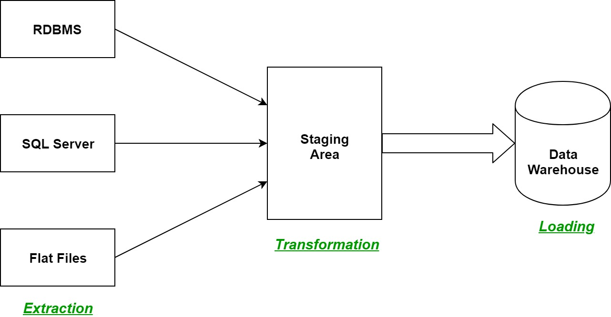

1. Hadoop
- Hadoop là một hệ thống mã nguồn mở giúp xử lý, lưu trữ và phân tích lượng dữ liệu khổng lồ.
- Các đặc điểm của Hadoop:
  + Khả năng mở rộng cao: Có thể mở rộng dễ dàng từ một máy chủ lên hàng ngàn máy tính.
  + Tính chịu lỗi: Tự động sao chép dữ liệu và quản lý lỗi để đảm bảo tính toàn vẹn của dữ liệu.
  + Hiệu quả chi phí: Sử dụng phần cứng thông thường để xử lý và lưu trữ dữ liệu lớn.
  + Khả năng xử lý dữ liệu lớn: Có thể xử lý khối lượng lớn dữ liệu ở tốc độ cao.
- Dữ liệu được chia làm 3 loại:
  + Structured Data: Có các cột và hàng với kiểu dữ liệu đã được xác định trước, dễ dàng truy vấn bằng SQL.
  + Unstructured Data: Không có định dạng cố định và khó khăn hơn trong việc phân tích và xử lý (văn bản, ảnh, video, bài viết)
  + Semi-Structured Data: Có một số thành phần cấu trúc như thẻ hoặc trường nhưng không theo định dạng cố định như dữ liệu cấu trúc (JSON, XML)

2. Big data
- Dữ liệu lớn được định nghĩa là dữ liệu có nhiều loại hơn, xuất hiện với khối lượng ngày càng tăng và với tốc độ ngày càng cao và yêu cầu một kiến ​​trúc có thể mở rộng để lưu trữ, thao tác và phân tích hiệu quả.
- Các đặc tính này cũng được gọi là ba V:
  + Volume (khối lượng): Với Big data, người ta phải xử lý khối lượng dữ liệu lớn. Đây có thể là dữ liệu có giá trị chưa xác định, chẳng hạn như nguồn cấp dữ liệu Twitter, luồng nhấp chuột trên trang web hoặc ứng dụng di động hoặc thiết bị hỗ trợ cảm biến.
  + Velocity (tốc độ): Velocity là tốc độ mà dữ liệu được tiếp nhận và xử lý. Thông thường, tốc độ cao nhất của dữ liệu sẽ truyền trực tiếp vào bộ nhớ, ngoài ra Một số sản phẩm thông minh hỗ trợ internet hoạt động theo thời gian thực hoặc gần thời gian thực và sẽ yêu cầu đánh giá và hành động theo thời gian thực.
  + Variety (sự đa dạng): Variety đề cập đến nhiều loại dữ liệu có sẵn, cụ thể là dữ liệu có cấu trúc và dữ liệu phi cấu trúc.
3. Data Warehouse
- Kho dữ liệu là hệ thống lấy dữ liệu từ nhiều nguồn khác nhau đến một tổ chức, chuyển đổi và lưu trữ dữ liệu đó cho mục đích báo cáo và phân tích.
- ETL (extract - transform - load) đối với Data Warehouse là quy trình quan trọng để chuẩn bị dữ liệu từ nhiều nguồn khác nhau, biến đổi dữ liệu đó thành một định dạng thích hợp, và tải nó vào Data Warehouse để hỗ trợ phân tích và báo cáo.  
- 

  + Extract (Trích xuất dữ liệu): Thu thập dữ liệu từ các nguồn khác nhau như cơ sở dữ liệu, file, ứng dụng web, API, vv...
  + Transform (Chuyển đổi dữ liệu): Làm sạch, định dạng và chuẩn hóa dữ liệu để nó có thể được sử dụng hiệu quả trong kho dữ liệu.
  + Load (Tải dữ liệu): Đưa dữ liệu đã chuyển đổi vào data warehouse.

a. Database và Data Warehouse
- Data Warehouse sử dụng OLAP (Online Analytical Processing) được tối ưu hóa để xử lý số lượng truy vấn phức tạp thấp trên các tập dữ liệu lịch sử lớn được tổng hợp. 
- Database sử dụng OLTP (Online Transaction Processing) để xóa, chèn, thay thế và cập nhật số lượng lớn các giao dịch trực tuyến ngắn.
- Về cơ bản, database được tối ưu hóa để đọc/ghi, trong khi data warehousr được tối ưu hóa để tổng hợp và truy xuất các tập dữ liệu lớn. 

b. BigData và Data Warehouse
- Data Warehouse thường bao gồm dữ liệu chi tiết và có cấu trúc tuân theo một lược đồ, tất cả được lưu trữ trong cơ sở dữ liệu quan hệ.
- BigData, dữ liệu nguồn tuân theo một cấu trúc lỏng lẻo và thường không được tinh chỉnh.

c. Data Lake
- Data Lake, một khái niệm về Big Data, đề cập đến việc lưu trữ dữ liệu thô, phi cấu trúc và có cấu trúc từ các nguồn dữ liệu của một tổ chức nhưng mục đích sử dụng vẫn chưa được xác định.
- Data lake lưu trữ dữ liệu ở mọi loại, kích thước và định dạng theo định dạng gốc cho đến khi cần và có khả năng lưu trữ lớn hơn data warehouse.

d. BigData trên cloud
- Big Data trên Cloud đề cập đến việc sử dụng các dịch vụ đám mây để lưu trữ, quản lý và phân tích khối lượng dữ liệu lớn. Các nền tảng đám mây cung cấp cơ sở hạ tầng linh hoạt và quy mô để xử lý Big Data mà không cần phải đầu tư vào phần cứng và phần mềm đắt tiền.

4. YARN (Yet Another Resource Negotiator)
- YARN có thể được coi là tương tự như hệ điều hành cho cluster.
- Cluster là một tập hợp các máy tính được kết nối lỏng lẻo hoặc chặt chẽ hoạt động cùng nhau để được xem như một hệ thống duy nhất.
- YARN có 2 trách nhiệm chính:
  + Quản lý tài nguyên cluster như tính toán, mạng và bộ nhớ.
  + Lên lịch và theo dõi công việc.
- YARN đạt được mục tiêu thông qua 2 deamon:
  + Resource Manager (quản lý tài nguyên) là master.
  + Node Manager (quản lý nút) là slave.


a. Resource manager
- Resource manager là cơ quan có thẩm quyền cuối cùng phân xử tài nguyên giữa tất cả các ứng dụng trong hệ thống.
- Gồm 2 phần:
  + Applications Manager: khởi động một container cho một thực thể được gọi là ApplicationMaster cho mỗi công việc.
  + Scheduler: phân bổ tài nguyên như đĩa, CPU và mạng chạy các ứng dụng.

b. Node manager
- Khởi chạy các container trên máy và quản lý việc sử dụng tài nguyên của các container.
- Báo cáo việc sử dụng trở lại thành phần Scheduler của Resource Manager.

5. Workflow
- Bước đầu tiên để chạy ứng dụng YARN bao gồm yêu cầu RM tạo một quy trình Application Master (AM).
- Một khách hàng gửi một công việc và RM tìm thấy một Node Manager có thể khởi chạy một container để lưu trữ quy trình AM.
- RM có các Node Manager trên các máy khác khởi chạy các vùng chứa thay mặt cho quy trình AM để chạy tính toán phân tán. Vùng chứa được phân bổ trên một node lưu trữ bản sao của khối dữ liệu.
- Việc ánh xạ công việc sang ứng dụng có thể diễn ra theo ba cách:
  + One job per application (Một công việc cho mỗi ứng dụng): Đây là mô hình đơn giản nhất.
  + Several jobs per application (Nhiều tác vụ trên mỗi ứng dụng) : Thích hợp để chạy nhiều tác vụ (có thể liên quan) như một quy trình làm việc hoặc trong một phiên người dùng duy nhất. Container có thể tái sử dụng trong công việc và dữ liệu trung gian giữa các công việc có thể được lưu trong bộ nhớ.
  + Perpetually running application (Ứng dụng chạy liên tục): Một ứng dụng đóng vai trò là bộ điều phối sẽ tiếp tục chạy, thậm chí là mãi mãi và được chia sẻ giữa nhiều người dùng khác nhau.  Apache Slider và Impala là hai ứng dụng sử dụng chiến lược này.

6. Scheduling
- FIFO Schuduler: không phù hợp với các cluster chia sẻ.
- Capacity Scheduler: các công việc được thực hiện theo cách FIFO, một hàng đợi có thể chiếm dụng dung lượng của một hàng đợi khác nếu hàng đợi kia không sử dụng tài nguyên của hàng đợi đó.
- Fair Scheduler: phân bổ tài nguyên một cách công bằng giữa tất cả các ứng dụng đang chạy.

7. Map Reduce
- MapReduce là mô hình lập trình được sử dụng để xử lý các tập dữ liệu lớn trên một cụm máy sản xuất hàng hóa bằng cách sử dụng thuật toán phân tán.
- MapReduce về cơ bản là một hệ thống xử lý hàng loạt và không phù hợp với phân tích tương tác.
- Mô hình bao gồm hai giai đoạn:
  + Giai đoạn Map: Người dùng chỉ định một hàm Map xử lý cặp key/value để tạo ra một tập hợp các cặp key/value trung gian.
  + Giai đoạn Reduce: hợp nhất tất cả các giá trị trung gian được liên kết với cùng một key trung gian.

- Đặc điểm của MapReduce:
  + Distributed (phân tán): Tasks được chia thành các khối nhỏ và phân phối trên các máy tính khác nhau trong cụm HDFS. 
  + Parallel (song song): Các Map và Reduce tasks hoạt động song song.
  + Fault tolerant (chịu lỗi): Nếu bất kỳ tác vụ nào bị lỗi, nó sẽ được lên lịch lại trên một nút khác.
  + Scalable (khả năng mở rộng): Mở rộng theo chiều ngang thay vì theo chiều dọc.

8. Mapper
- Nhận giá trị đầu vào, sau đó phân tích chuyển đổi thành các cặp key-value trung gian. 
```java
public class Mapper<KEYIN, VALUEIN, KEYOUT, VALUEOUT> {
        //...class body
    }
```
- Các cặp khóa-giá trị trung gian được ghi tạm thời vào bộ đệm trong bộ nhớ (in-memory buffer). Bộ đệm này có kích thước giới hạn (mặc định là khoảng 100 MB trong Hadoop), và khi nó đầy, dữ liệu sẽ được đổ (spill) ra đĩa.
  Khi bộ đệm đầy, dữ liệu được sắp xếp (sort) trong bộ nhớ và sau đó được ghi ra đĩa tạm thời. Quá trình này được gọi là "spill".
- Việc sắp xếp dữ liệu xảy ra ở phía Map chứ không phải ở phía Reduce.

9. Reducer
- Tổng hợp và xử lý các cặp khóa-giá trị trung gian đã được tạo ra bởi Mapper từ giai đoạn Shuffle và Sort.

10. Quy trình làm việc của MapReduce trong Hadoop

a. Gửi Công Việc MapReduce:
```java
job.waitForCompletion(true);
```
Phương thức này trả về khi công việc đã hoàn thành thành công. 

b. Khởi Tạo ID Công Việc và Kiểm Tra Tính Hợp Lệ:
- Lớp JobSubmitter chịu trách nhiệm giao tiếp với resource manager và lấy ID ứng dụng mới được sử dụng làm ID của công việc MapReduce. 
- Kiểm tra các hợp lệ.  

c. Sao chép tài nguyên lên HDFS:

- Tài nguyên được sao chép lên HDFS trong một thư mục staging, với ID của công việc trong đường dẫn.

d. Gửi công việc đến Resource Manager:

- Công việc được gửi đến resource manager bằng cách gọi phương thức submitApplication(), sau đó chuyển yêu cầu đến YARN scheduler.
- Một container được cấp phát và một tiến trình application master, được biểu diễn bởi lớp MRAppMaster, được khởi chạy trong container, quản lý bởi Node manager.

e. Quản lý và giám sát công việc:

- MRAppMaster xin tài nguyên từ Resource Manager, cùng Node Manager thực thi task.

f. Khởi tạo và phân bố tác vụ:

- ApplicationMaster khởi tạo các book-looking để giám sát tiến trình các task của map và reduce.
- Các input splits được tính toán và tạo một map task cho từng split.
- Số lượng tác vụ reduce được kiểm soát bởi thuộc tính mapreduce.job.reduces.

g. Thực Thi Các Tác Vụ:

- ApplicationMaster quyết định chạy các tác vụ map và reduce trong cùng một JVM hoặc yêu cầu containers để các tác vụ có thể chạy song song.
- Nếu không thể chạy công việc khi được thực thi trong cùng một JVM với ApplicationMaster, ApplicationMaster yêu cầu containers cho tất cả các tác vụ map và reduce từ resource manager.

h. Báo Cáo Tiến Trình và Hoàn Thành Công Việc:

- Khi ApplicationMaster nhận được thông báo về việc hoàn thành tác vụ cuối cùng, nó đánh dấu trạng thái công việc là thành công. 
- Phương thức waitForCompletion() trên phía client trả về.
